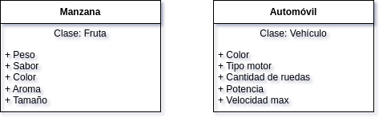
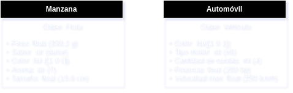
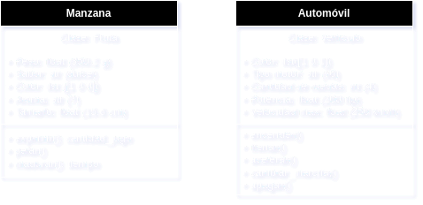
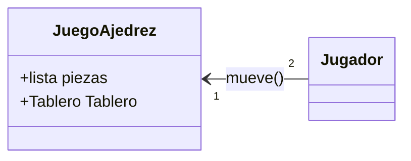
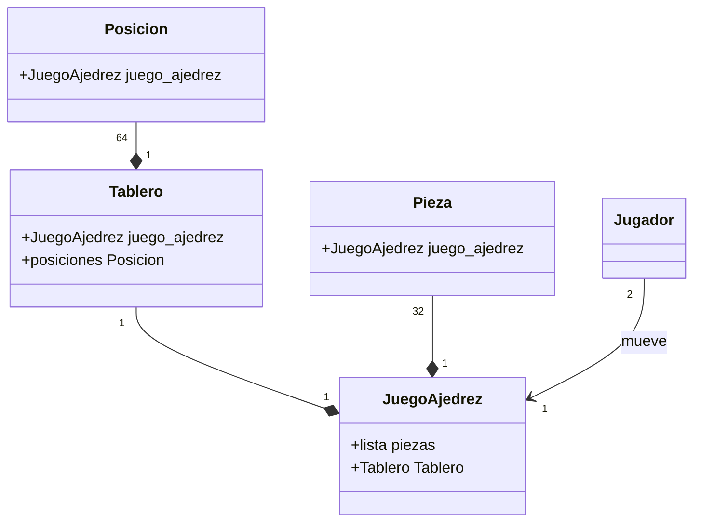
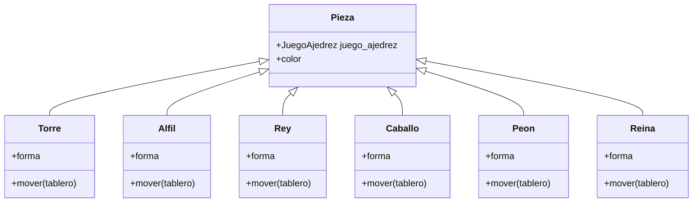

# Programación Orientada a Objetos - UNAL

## Clase 5: Clases y Objetos

### Clase
Una clase es un *plano* o *plantilla* para crear objetos. Define un tipo de objeto especificando los datos que puede contener y los métodos (comportamientos) aplicables. 

**Ejemplos:**
 - Clase Fruta podría definir atributos como color y sabor, y métodos como madurar().
 - Clase de Vehículos como un concepto general. Todos los vehículos comparten características comunes como tener medios de locomoción y la capacidad de transportar personas o cosas, pero cada tipo (coche, bicicleta, avión) tiene sus propias especificaciones.

 
 

    

### Modelado por Clases
El modelado por clases permite a los desarrolladores organizar y estructurar su software de manera que refleje más fielmente el mundo real. En general facilita la comprensión del sistema al modelar entidades del mundo real de manera intuitiva. 

### Objeto
Un objeto es una *instancia* de una clase. Posee los atributos definidos por su clase y es capaz de realizar los comportamientos (métodos) definidos por ella. 

**Ejemplos:**
- Una instancia de la clase Fruta podría ser una manzana específica, con un color rojo y un sabor dulce.
- Una instancia de vehículo puede ser un Automóvil, con color rojo, locomoción por motor de combustión, y comportamientos de encender, frenar y apagar.

 
 

    

## Diseño Orientado a Objetos (OOP)
El **OOP** es una metodología de diseño y programación que se centra en el uso de objetos y clases. Su función principal es modelar datos, tratando de extraer sus atributos y comportamientos. Su enfoque primario es centrarse en objetos que representan conceptos del mundo real 

### Abstracción
La abstracción es un principio fundamental del OOP que implica enfocarse en las características esenciales de un objeto, ignorando las menos importantes o irrelevantes. 

### Abstracción en el Mundo Real
Los seres humanos abstraen constantemente, simplificando complejidades para entender y interactuar con el mundo. Por ejemplo, al considerar un automóvil, nos enfocamos en su funcionalidad (conducir, frenar, acelerar) más que en los detalles complejos de su funcionamiento interno.

Al usar un televisor, interactúas con un conjunto limitado de controles (botones para cambiar el canal, ajustar el volumen, etc.), sin necesidad de entender la complejidad interna de cómo funciona el televisor.

## Datos, Atributos y Comportamientos
- **Datos** describen los estados de un objeto.
- **Atributos** son características específicas de un objeto.
- **Comportamientos** son las acciones que un objeto puede realizar.

 
 

    

## Herencia y Composición
La Herencia permite que una clase herede atributos y métodos de otra clase, facilitando la reutilización de código y la creación de jerarquías de clases.

Composición implica construir clases complejas a partir de la inclusión de objetos de otras clases, promoviendo una fuerte separación y modularidad.

### Comparación entre Herencia y Composición
Mientras que la herencia establece una relación `es un/a` (por ejemplo, un Perro es un Animal), la composición establece una relación `tiene un/a` (por ejemplo, un Coche tiene un Motor). La composición es generalmente preferida para mantener una baja acoplamiento y una alta cohesión.

**Ejemplos de Herencia:**

 - Un pato es un tipo de ave, por lo que hereda características comunes de las aves, como tener plumas y la capacidad de volar (aunque no todas las aves vuelan).
 - Una clase Pato puede heredar de una clase Ave, obteniendo sus métodos y atributos, y también puede tener sus propios métodos, como nadar().

**Ejemplos de Composición:**

 - Un coche tiene un motor. En lugar de ser un tipo de motor, el coche compone un motor entre sus partes.
 - La clase Coche puede contener un objeto Motor como atributo, lo que le permite acceder a los métodos del motor, como arrancar_motor().

## UML (Lenguaje Unificado de Modelado)
UML es una herramienta estándar para especificar, visualizar, construir y documentar los artefactos de sistemas de software. Facilita la representación gráfica de clases, objetos, y sus relaciones, a través de diversos diagramas, como los diagramas de clases y de secuencia.

### Recursos de UML
1. Para diagramas relativamente generales: [Draw.io](https://www.draw.io/index.html), es bastante bueno, solo que son diagramas fijos.
2. Para diagramas "pro": [Mermaid](https://mermaid.js.org/intro/), permite hacer diagramas de casi cualquier tipo y embeberlos en sitios web, como por ejemplo en git. [Editor Mermaid](https://mermaid.live/edit#pako:eNptkctOAzEMRX8l8oqKzg-M2CBKJRZddYciIU9iTa3JA_JQVUr_ncyUCaUlK_s417q2j6C8JmhBGYxxxdgHtNKJ8h4dWzTi4atpxCqr4ZauOe5u6St1Af_gVtyzSwJ7usbbFNj1oienKVwWR0ncoC3h3eKqYDHRDCfbk73jGYjatCMcnrzxoRbinu0sLOlHRjXM-emy3zhY7deM3iN_0otbE6WKFbpnTP_qpxX8Guq8N4Lj256NrjBkV7WwBEvBIutyiUknIe3IkoS2hBrDIEG68R_m5LcHp6BNIdMS8rsu6_g53BmevgFsko8R). Todas la relaciones de clases [aquí](https://mermaid.js.org/syntax/classDiagram.html#defining-relationship).

### Caso de Estudio: Ajedrez (el cliché)
Suponga que se debe modelar a través de UML las relaciones entre clases de un juego de ajedrez.

**Relación jugador - juego**

**Relación juego - tablero**

**Relaciones entre piezas**

-------
### Info adicional

- [Qué es un objeto...estrictamente hablando](https://www.reddit.com/r/computerscience/comments/1an2ssn/strictly_speaking_what_is_an_object_in_programming/?rdt=61253) 
- [POO para dummies](https://trujillo9616.medium.com/oop-for-dummies-3e6007c8e7f4) 
- [Definción de objeto -- Ciencias de la computación](https://en.wikipedia.org/wiki/Object_(computer_science)) 
- [More on UML diagrams](https://medium.com/@ibrahimsengun/uml-diagrams-1ff75deaf3a2) 
- [Even more UML](https://medium.com/@techsuneel99/understanding-uml-the-unified-modeling-language-bfec589df4f7) 
-------

## Reto 2
Desarrolle la mayoría de ejercicios en clase. Para cada punto cree un programa individual. Al finalizar suba todo a un repo y súbalo al canal reto_2 en slack.

1. Elija un problema de la vida real (sistema de gestión de biblioteca, negocio de compra-venta, automóvil, etc) que se pueda modelar a través de objetos y clases. Plantee las relaciones de clases, composiciones, propiedades y comportamientos del sistema en uno mas diagramas tipo UML.